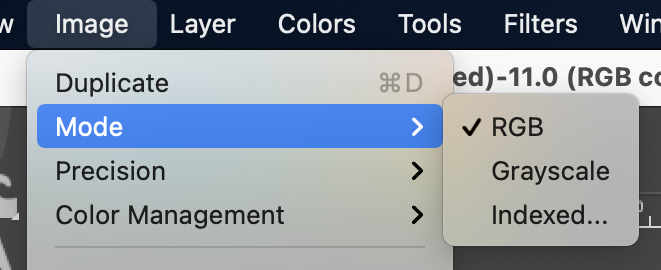
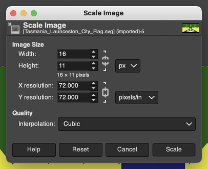
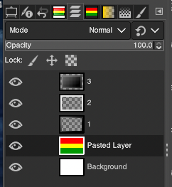
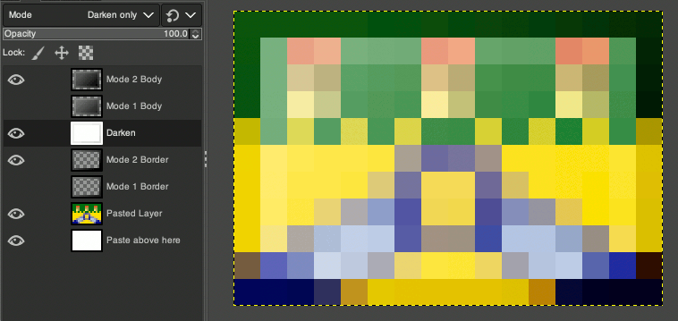

# New Gloss for Extra Flags
In development. May change in the future.
### GUIDE- How To Use This Gloss

This guide is meant for GIMP. I don't use Paint.NET but there is a .pdn file anyway.

1. Download and install GIMP
2. Download Gloss.xcf (GIMP) or Gloss.pdn (Paint.NET) and open it
3. Download then open a flag image with GIMP. Ensure that the flag's Mode is 'RGB' instead of 'Indexed'

4. Resize the flag to 16x11px with the interpolation set to 'Cubic' ('None' could also be used for some flags)

5. Copy the resized flag, go back to the Gloss.xcf tab, and paste it on top of the bottom layer.

6. OPTIONAL: Gloss modifications. You can switch between Modes 1 and 2. Mode 2 Border is default and the darkest, but the lighter Mode 1 is also available. I also usually turn off the Darken layer for yellow flags (but don't turn Darken off if there is white around the border).

![6[(images/6.png)

7. Export as a png file.

