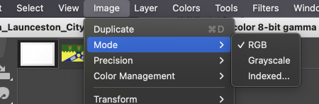

# Alternative Gloss for Extra Flags

### GUIDE- How To Use This Gloss And Make Flag Icons

This guide is meant for GIMP. I don't use Paint.NET but there is a .pdn file anyway.

1. Download and install GIMP or Paint.NET
2. Download Gloss.xcf (GIMP) or Gloss.pdn (Paint.NET) and open it
3. Download then open a flag image with GIMP or Paint.NET. Ensure that the flag's Mode is 'RGB' instead of 'Indexed'.

4. Resize the flag to 16x11px with the interpolation set to 'Cubic' ('None' can also be used, it depends on the flag)

5. Copy the 16x11px flag, go back to the Gloss.xcf tab, and then paste it on top of the '**Background**' layer.

6. Export as a png file.

