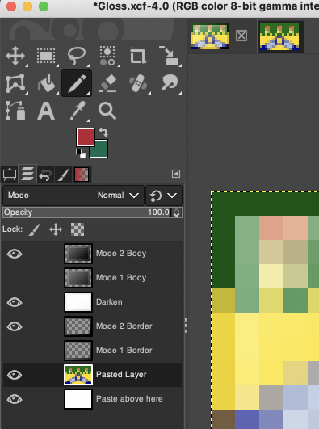

# New Flag Gloss

### GUIDE- How To Use This Gloss And Make Proper Flag Icons

1. Download and install GIMP. https://www.gimp.org/
2. Download Gloss.xcf and open it with GIMP. https://github.com/shoal3/ExtraFlagGloss/blob/main/Gloss.xcf?raw=true
3. Download then open a flag image with GIMP. Check that the flag's image mode is 'RGB' instead of 'Indexed'.

4. Resize the flag to 16x11px with the interpolation set to 'Cubic' ('None' can also be used, it depends on the flag)

5. Copy the 16x11px flag, go back to the Gloss.xcf tab, and then paste it on top of the '**Background**' layer.

6. Export as a png or gif file.

